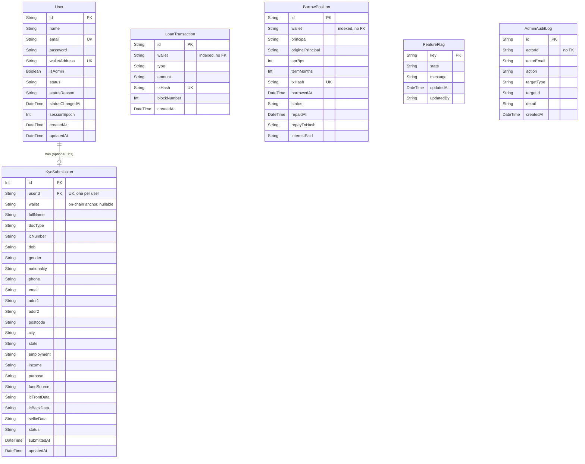

## 8. Database Design

The web app persists to a single **PostgreSQL** database (Railway in production) via **Prisma** ORM ([`web/prisma/schema.prisma`](../../../web/prisma/schema.prisma)). `BankAccount`/`BankTransfer` never appear in the schema. Bank Transfer was dropped from the product before this schema was written, so there's nothing to remove here.

### Table of contents, Section 8

- [8.1 On-Chain vs Off-Chain Split](#81-on-chain-vs-off-chain-split)
- [8.2 Schema at a Glance](#82-schema-at-a-glance)
- [8.3 Entity-Relationship Diagram](#83-entity-relationship-diagram)
- [8.4 Table-by-Table Walkthrough](#84-table-by-table-walkthrough)

---

### 8.1 On-Chain vs Off-Chain Split

The database is deliberately **not** the source of truth for money. That role belongs entirely to the `CryptoLoan` contract (collateral, debt, interest, the per-wallet `kycApproved` flag; see Section 9 below). Postgres owns everything else (accounts, KYC submissions and documents, feature flags, and the admin audit trail), and one table, `LoanTransaction`, exists purely as a **read-optimised mirror** of on-chain events, not as a payment record. If the database and the chain ever disagree about a balance, the chain wins; Section 7.5 Portfolio (in the full document) makes this explicit by falling back to the database mirror only when a live chain read isn't available.

### 8.2 Schema at a Glance

Six models, defined in [`web/prisma/schema.prisma`](../../../web/prisma/schema.prisma):

- **`User`**, the account: `email`+`password` and/or a linked `walletAddress`, `isAdmin`, `status` (`ACTIVE`/`RESTRICTED`), `sessionEpoch` (JWT invalidation).
- **`KycSubmission`**, one per user (not per wallet): personal/address/financial fields, ID document images, `status` (`pending`/`approved`/`rejected`).
- **`LoanTransaction`**, a mirrored copy of on-chain protocol events, keyed by wallet + unique `txHash`.
- **`BorrowPosition`**, the itemised per-borrow tranche ledger that powers the Repay tab's installment breakdown.
- **`FeatureFlag`**, admin overrides (`ON`/`MAINTENANCE`/`HIDDEN`) on top of the `lib/features.ts` registry.
- **`AdminAuditLog`**, append-only record of every admin mutation.

### 8.3 Entity-Relationship Diagram



`User → KycSubmission` is the only enforced foreign key in the schema. `LoanTransaction`, `BorrowPosition`, and `AdminAuditLog` deliberately key off a **wallet address / actor ID string** rather than a relation. They're append-only, event-sourced tables mirroring on-chain or admin activity that must keep existing even if the referenced account is later restricted or its wallet unlinked.

The same seven tables as deployed, from Supabase's own Schema Visualizer (`public` schema, `jianzhi86's Project`):


### 8.4 Table-by-Table Walkthrough

**`User`**, the account record:

```prisma
model User {
  id            String        @id @default(cuid())
  name          String?
  email         String?       @unique
  password      String?
  walletAddress String?       @unique
  isAdmin       Boolean       @default(false)
  status        String        @default("ACTIVE")
  statusReason  String?
  statusChangedAt DateTime?
  sessionEpoch  Int           @default(0)
  createdAt     DateTime      @default(now())
  updatedAt     DateTime      @default(now()) @updatedAt
  kyc           KycSubmission?
}
```

Either `email`+`password`, `walletAddress`, or both, may be set (never `walletAddress`-only *and* email-only-without-a-password; see the Settings invariant in Section 7.14). `status` is `"ACTIVE"` or `"RESTRICTED"`; a restricted account can still sign in and read but every write is refused off-chain. This cannot stop the wallet from calling the contract directly. `sessionEpoch` is bumped on password reset to invalidate every JWT already issued to that user, since sessions are stateless cookies rather than server-tracked.

The live `User` table in Supabase's Table Editor:


**`KycSubmission`**, one row per **user**, not per wallet:

```prisma
model KycSubmission {
  id          Int      @id @default(autoincrement())
  userId      String   @unique
  user        User     @relation(fields: [userId], references: [id])
  wallet      String?
  fullName    String
  docType     String   @default("ic")
  icNumber    String
  dob         String
  gender      String
  nationality String
  phone       String
  email       String
  addr1       String
  addr2       String   @default("")
  postcode    String
  city        String
  state       String
  employment  String
  income      String
  purpose     String
  fundSource  String
  icFrontData String?
  icBackData  String?
  selfieData  String?
  status      String   @default("pending")
  submittedAt DateTime @default(now())
  updatedAt   DateTime @updatedAt

  @@index([wallet])
}
```

`userId` being `@unique` is what lets verification survive a wallet being unlinked and relinked, and stops a freed wallet from inheriting a stranger's approval (see Section 7.13). `wallet` is only the on-chain anchor used when the server calls `setKYC()` ([9.6](#96-admin--oracle-functions)), and is `null` until a wallet is linked. The five wizard steps map directly onto its fields: personal info (`fullName`…`nationality`), contact (`phone`, `email`), address (`addr1`…`state`), financial declaration (`employment`, `income`, `purpose`, `fundSource`), and documents (`icFrontData`, `icBackData`, `selfieData`, stored as base64 data URIs *in the row itself*, served back out through `GET /api/kyc/documents` rather than an external object store).

**`LoanTransaction`**, a denormalised mirror of on-chain protocol events:

```prisma
model LoanTransaction {
  id          String   @id @default(cuid())
  wallet      String
  type        String
  amount      String
  txHash      String   @unique
  blockNumber Int
  createdAt   DateTime @default(now())

  @@index([wallet])
}
```

Indexed by `wallet` and unique on `txHash` so re-indexing the same block twice can't double-insert. This is what backs the Explorer (Section 7.6) and Portfolio history (Section 7.5) without hitting an RPC node for every page load. It's populated by `POST /api/loan-tx`, which `WalletContext.tsx` calls right after every confirmed transaction (see the `saveTxToDB` calls throughout [9.5](#95-core-function-walkthroughs)).

The live `LoanTransaction` table in Supabase's Table Editor:


**`BorrowPosition`**, the itemised **tranche ledger** on top of the contract's aggregate position:

```prisma
model BorrowPosition {
  id           String    @id @default(cuid())
  wallet       String
  principal    String
  originalPrincipal String @default("0")
  aprBps       Int
  termMonths   Int       @default(1)
  txHash       String    @unique
  borrowedAt   DateTime  @default(now())
  status       String    @default("OPEN") // OPEN | REPAID
  repaidAt     DateTime?
  repayTxHash  String?
  interestPaid String?

  @@index([wallet, status])
}
```

On-chain, `CryptoLoan.loans[wallet]` collapses *all* of a wallet's borrows into a single `principal`/`startTime` pair; the Repay tab (Section 7.10), however, needs to list and settle each borrow separately, "Month M of N", at the APR that was locked in *when that borrow happened*. So each `borrow()` call writes one row here, capturing `aprBps` and `termMonths` as frozen values. `principal` shrinks as repayments settle against the row; `originalPrincipal` never changes, and the difference between the two is what lets an early payoff still correctly compute "how many of the N installments are done" instead of just dividing by elapsed calendar time. The chain remains authoritative for the wallet's real total debt. This table is purely the itemisation layer for the UI.

The live `BorrowPosition` table in Supabase's Table Editor:


**`FeatureFlag`**, one optional override row per feature key declared in `lib/features.ts`:

```prisma
model FeatureFlag {
  key       String   @id
  state     String   @default("ON")
  message   String   @default("")
  updatedAt DateTime @default(now()) @updatedAt
  updatedBy String?
}
```

An **empty table means every feature defaults to on**. `state` is `"ON"`, `"MAINTENANCE"` (visible, blocked, shows `message`), or `"HIDDEN"` (removed from navigation, direct routes 404). This is the mechanism behind every "temporarily paused" state referenced throughout Section 7: signups (7.1), logins (7.2), and each of the five loan actions (7.7-7.11) independently.

The live `FeatureFlag` table in Supabase's Table Editor:


**`AdminAuditLog`**, append-only by design:

```prisma
model AdminAuditLog {
  id         String   @id @default(cuid())
  actorId    String
  actorEmail String?
  action     String
  targetType String
  targetId   String
  detail     String?
  createdAt  DateTime @default(now())

  @@index([createdAt])
  @@index([targetType, targetId])
}
```

Never edited or deleted by the app. There is deliberately no update/delete endpoint for it (see Section 7.12). `detail` stores a JSON blob (`{ before, after }`) as text rather than a native JSON column, to stay portable across the raw-SQL paths the app uses elsewhere. Indexed on `createdAt` (for the audit feed) and on `(targetType, targetId)` (for "show me every action taken on this user/submission").

The live `AdminAuditLog` table in Supabase's Table Editor:


---
