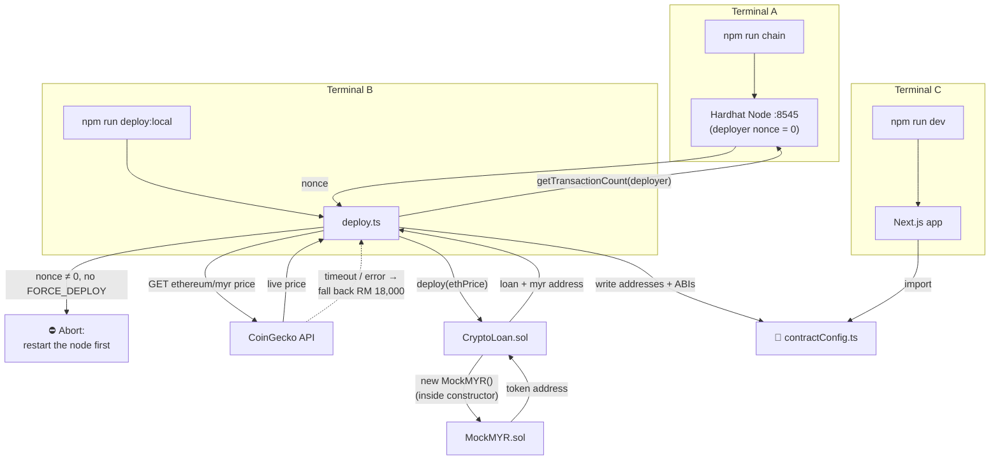

## 6. Smart Contract Deployment

CryptoLend's blockchain layer lives entirely inside `blockchain/`, an independent Hardhat + TypeScript project (Solidity `0.8.24`, optimizer on at 200 runs, `viaIR` enabled) with no runtime dependency on the `web/` Next.js app. The two projects only ever touch through one generated file, `web/src/lib/contractConfig.ts`, produced by the deploy step below.

| Layer              | Technology                                                               |
| ------------------ | ------------------------------------------------------------------------ |
| Smart contracts    | Solidity `0.8.24`, Hardhat, OpenZeppelin `5.1`                           |
| Deployment tooling | Hardhat scripts (`deploy.ts`, `verify.ts`, `set-price.ts`), ethers.js v6 |
| Networks           | Hardhat local (chain `31337`), Sepolia, Ethereum Mainnet (via Alchemy)   |

### Table of contents, Section 6

- [6.1 Prerequisites & Environment Variables](#61-prerequisites--environment-variables)
- [6.2 Installing Dependencies](#62-installing-dependencies)
- [6.3 Network Configuration](#63-network-configuration)
- [6.4 Local Deployment (Hardhat Node)](#64-local-deployment-hardhat-node)
- [6.5 What `deploy.ts` Actually Does](#65-what-deployts-actually-does)
- [6.6 Testnet / Mainnet Deployment & Verification](#66-testnet--mainnet-deployment--verification)
- [6.7 Post-Deploy Operations](#67-post-deploy-operations)
- [6.8 Optional: ICO Demo Deployment](#68-optional-ico-demo-deployment)
- [6.9 Common Deployment Errors](#69-common-deployment-errors)

---

### 6.1 Prerequisites & Environment Variables

`hardhat.config.ts` reads its secrets from a single `.env` file at the **repo root** (`dotenv.config({ path: "../.env" })`), not from inside `blockchain/`. Copy `.env.example` to `.env` and fill in:

| Variable            | Required for                                       | Notes                                                                                                                             |
| ------------------- | -------------------------------------------------- | --------------------------------------------------------------------------------------------------------------------------------- |
| `OWNER_PRIVATE_KEY` | Sepolia / Mainnet deploys, and any owner-only call | On local Hardhat, account #0's well-known test key (`0xac09...2ff80`) is used by convention; never reuse it outside a local chain |
| `ALCHEMY_API_KEY`   | Sepolia / Mainnet                                  | Feeds the RPC URL for both networks                                                                                               |
| `ETHERSCAN_API_KEY` | Contract verification                              | Used by `verify.ts` / `hardhat-toolbox`'s `verify:verify` task                                                                    |
| `REPORT_GAS`        | Optional                                           | `"true"` enables a gas-cost report on `npm test`                                                                                  |

Local deployment needs none of these. Hardhat's built-in `hardhat`/`localhost` network signs with its own funded test accounts.

### 6.2 Installing Dependencies

```bash
cd blockchain
npm install
```

| Package                            | Role                                                                                                              |
| ---------------------------------- | ----------------------------------------------------------------------------------------------------------------- |
| `hardhat`                          | Local Ethereum node, Solidity compiler, test runner, deploy-script host                                           |
| `@nomicfoundation/hardhat-toolbox` | Bundles ethers.js, Chai matchers, the gas reporter, and the Etherscan verification plugin                         |
| `@openzeppelin/contracts`          | Audited base contracts the protocol inherits: `ReentrancyGuard`, `Pausable`, `Ownable2Step`, `ERC20`, `SafeERC20` |
| `dotenv`                           | Loads the repo-root `.env` into `hardhat.config.ts`                                                               |

Node is pinned to **20** via the repo's `.nvmrc` (`nvm use` if available). `blockchain/` and `web/` are installed completely independently. There is no workspace/monorepo tooling tying their `node_modules` together, so `npm install` must be run in each folder separately.

### 6.3 Network Configuration

Four networks are declared in [`hardhat.config.ts`](../../../blockchain/hardhat.config.ts):

```ts
networks: {
  hardhat:  { chainId: 31337 },
  localhost:{ url: "http://127.0.0.1:8545", chainId: 31337 },
  sepolia:  { url: `https://eth-sepolia.g.alchemy.com/v2/${ALCHEMY_KEY}`, chainId: 11155111, accounts: [DEPLOYER_PK] },
  mainnet:  { url: `https://eth-mainnet.g.alchemy.com/v2/${ALCHEMY_KEY}`, chainId: 1,        accounts: [DEPLOYER_PK] },
}
```

`hardhat` and `localhost` both target chain ID `31337`, which is also the chain ID MetaMask must be configured with for local testing (see Section 7.1 onward, and Section 11, in the full document).

### 6.4 Local Deployment (Hardhat Node)

Deployment is a fixed three-terminal sequence; this is also how Section 5, Running the System, starts the whole stack:

```bash
# Terminal A (keep running)        # Terminal B (one-shot)              # Terminal C
cd blockchain                      cd blockchain                       cd web
npm run chain                      npm run deploy:local                npm run dev
```

- `npm run chain` → `hardhat node`: starts an in-memory Ethereum node on `127.0.0.1:8545`, printing 20 funded test accounts and their private keys (import one into MetaMask).
- `npm run deploy:local` → `hardhat run scripts/deploy.ts --network localhost`: compiles and deploys the contracts, detailed function-by-function in [6.5](#65-what-deployts-actually-does).
- `npm run dev`: starts the Next.js app, which reads the contract addresses/ABIs the deploy step just wrote.

Available scripts, from [`blockchain/package.json`](../../../blockchain/package.json):

| Script                                      | Command                                             |
| ------------------------------------------- | --------------------------------------------------- |
| `npm run compile`                           | `hardhat compile`                                   |
| `npm run chain` / `npm run node`            | `hardhat node`                                      |
| `npm run deploy:local`                      | `hardhat run scripts/deploy.ts --network localhost` |
| `npm run deploy:sepolia` / `deploy:mainnet` | same script, `--network sepolia` / `mainnet`        |
| `npm run verify:sepolia` / `verify:mainnet` | `hardhat run scripts/verify.ts --network <net>`     |
| `npm test`                                  | `hardhat test`                                      |
| `npm run clean`                             | `hardhat clean`                                     |

The full sequence, end to end:



### 6.5 What `deploy.ts` Actually Does

[`scripts/deploy.ts`](../../../blockchain/scripts/deploy.ts) is not a bare `factory.deploy()` call. It encodes three deliberate safety/convenience behaviours.

**1. Fresh-node guard.** `CryptoLoan`'s address is derived from `(deployer, nonce)`, and its constructor deploys `MockMYR` internally, so *that* address is derived from `(CryptoLoan's address, its own nonce 0)`. Deploying onto a node whose deployer nonce isn't `0` would silently place both contracts at new addresses, and since MetaMask keys imported ERC-20 tokens by address, every redeploy would leave a stale duplicate "MYR" token behind in the wallet. The script therefore refuses to run unless the deployer's nonce is `0`, with an explicit override:

```ts
const nonce = await ethers.provider.getTransactionCount(deployer.address);
if (nonce !== 0 && process.env.FORCE_DEPLOY !== "1") {
  console.error(/* ...restart the node, or set FORCE_DEPLOY=1... */);
  process.exitCode = 1;
  return;
}
```

**2. Live price seeding.** Before deploying, it fetches the current ETH/MYR rate from CoinGecko so the contract doesn't start on a stale hardcoded number, falling back to `RM 18,000` if the API call fails or times out (5s):

```ts
const res = await fetch(
  "https://api.coingecko.com/api/v3/simple/price?ids=ethereum&vs_currencies=myr",
  { signal: AbortSignal.timeout(5000) }
);
```

**3. Deploy, then generate the frontend config.** `CryptoLoan` is deployed with that price as its constructor argument (its constructor deploys `MockMYR` as part of the same transaction). The script then reads the compiled ABIs out of `artifacts/` and writes a single auto-generated file the Next.js app imports directly, with no manual address copy-pasting between the two projects:

```ts
const CryptoLoan = await ethers.getContractFactory("CryptoLoan");
const loan = await CryptoLoan.deploy(ethPrice);
await loan.waitForDeployment();

const loanAddress = await loan.getAddress();
const myrAddress  = await loan.myr();
// ...writes web/src/lib/contractConfig.ts with CONTRACT_ADDRESSES, CRYPTO_LOAN_ABI, MOCK_MYR_ABI
```

The generated `web/src/lib/contractConfig.ts` carries a `!! do not edit manually !!` header and exports `HARDHAT_CHAIN_ID`, `HARDHAT_RPC_URL`, `ETH_PRICE_MYR`, `CONTRACT_ADDRESSES` (`CryptoLoan`, `MockMYR`), and the two full contract ABIs. This is the exact file `WalletContext.tsx` imports to build its contract instances (see [9.5](#95-core-function-walkthroughs)). Any restart of the Hardhat node resets its state, so **the contracts must be redeployed** (`npm run deploy:local`) after every restart; this is called out again in Section 11, Troubleshooting.

### 6.6 Testnet / Mainnet Deployment & Verification

The same `deploy.ts` script targets Sepolia or Mainnet by swapping the `--network` flag, using `OWNER_PRIVATE_KEY` and `ALCHEMY_API_KEY` from `.env`:

```bash
npm run deploy:sepolia   # hardhat run scripts/deploy.ts --network sepolia
npm run deploy:mainnet   # hardhat run scripts/deploy.ts --network mainnet
```

[`scripts/verify.ts`](../../../blockchain/scripts/verify.ts) then submits both contracts to Etherscan. It doesn't take addresses as arguments. It re-parses them straight out of the `contractConfig.ts` that the deploy step just generated, so there's no risk of verifying the wrong address:

```ts
const content = fs.readFileSync(configPath, "utf8");
const loanMatch = content.match(/CryptoLoan:\s*"(0x[0-9a-fA-F]+)"/);
const myrMatch  = content.match(/MockMYR:\s*"(0x[0-9a-fA-F]+)"/);
const priceMatch = content.match(/ETH_PRICE_MYR\s*=\s*(\d+)/);

await run("verify:verify", {
  address: loanAddress,
  constructorArguments: [Number(ethPrice)],
  contract: "contracts/CryptoLoan.sol:CryptoLoan",
});
```

```bash
npm run verify:sepolia   # or verify:mainnet
```

### 6.7 Post-Deploy Operations

[`scripts/set-price.ts`](../../../blockchain/scripts/set-price.ts) is an operational script, run any time after deployment to push a fresh ETH/MYR price on-chain manually. It's the same underlying call the app's own price-sync job makes automatically via the owner key (see [9.6](#96-admin--oracle-functions) and Section 7.3's price self-healing note in the full document). It resolves the deployed `CryptoLoan` address from `contractConfig.ts` if `LOAN_ADDR` isn't set, then either uses `PRICE=<number>` or fetches a live CoinGecko quote:

```bash
PRICE=19500 npx hardhat run scripts/set-price.ts --network localhost
# or, to pull a live quote automatically:
npx hardhat run scripts/set-price.ts --network localhost
```

Recall from Section 9 (below) that `setEthPrice()` enforces a ±20% max move per call (`MAX_PRICE_CHANGE`), so a very stale on-chain price may need more than one call to reach the current market rate.

### 6.8 Optional: ICO Demo Deployment

The `/ico` page is a separate, self-contained token-sale demo, unrelated to the lending protocol. [`scripts/deploy-ico.ts`](../../../blockchain/scripts/deploy-ico.ts) deploys `RinggitToken` (mints its full 100,000-token supply to the deployer) and `ICO` (priced so that 1 `MYRC` token costs the ETH-equivalent of RM 1, derived from the same live CoinGecko rate), then has the deployer `approve()` the `ICO` contract to sell the entire supply on its behalf:

```bash
npm run deploy:ico
```

This writes its own generated config, `web/src/lib/icoConfig.ts` (`ICO_ADDRESSES`, `ICO_PRICE_WEI`, ABIs), independent of `contractConfig.ts`. It is not required for the core deposit/borrow/repay flow.

### 6.9 Common Deployment Errors

Every message below is a real guard from the deploy tooling or the contract itself, not a hypothetical, so each is worth recognising on sight rather than re-diagnosing from scratch.

| Error                                                                                         | Where it appears                                                      | Fix                                                                                                                                                                           |
| --------------------------------------------------------------------------------------------- | --------------------------------------------------------------------- | ----------------------------------------------------------------------------------------------------------------------------------------------------------------------------- |
| `Node is not fresh — deployer nonce is X, expected 0`                                         | `npm run deploy:local`, before any contract is touched (§6.5)         | Restart the Hardhat node (`npm run chain`) and deploy as the very first action against it, or re-run with `FORCE_DEPLOY=1` to accept a new `MockMYR` address                  |
| `contractConfig.ts not found — run deploy first`                                              | `npm run verify:sepolia` / `verify:mainnet`                           | Deploy to that network first (`npm run deploy:sepolia` / `deploy:mainnet`) so `contractConfig.ts` exists for `verify.ts` to read addresses from                               |
| `Could not parse contract addresses from contractConfig.ts`                                   | `verify.ts`                                                           | The generated file is missing or malformed; redeploy to regenerate it                                                                                                         |
| `Could not find CryptoLoan address in contractConfig.ts`                                      | `set-price.ts`, when `LOAN_ADDR` isn't set                            | Deploy first, or pass `LOAN_ADDR=0x...` explicitly                                                                                                                            |
| `Could not determine new price. Set PRICE=<number> env var or ensure CoinGecko is reachable.` | `set-price.ts`                                                        | Set `PRICE=<number>` manually, or check network access to CoinGecko                                                                                                           |
| `Invalid price`                                                                               | `CryptoLoan` constructor / `setEthPrice()` (contract-level `require`) | The price argument was `0`; pass a positive integer                                                                                                                           |
| `Price move too large`                                                                        | `setEthPrice()` (contract-level `require`, `MAX_PRICE_CHANGE`)        | A single call moved the price by more than 20%; step toward the target in smaller increments, the way `price-sync.ts` does automatically ([9.6](#96-admin--oracle-functions)) |
| `Rate exceeds cap`                                                                            | `setBaseRate()` (contract-level `require`, `MAX_BASE_RATE_BPS`)       | Requested `rateBps` exceeds 1500 (15%)                                                                                                                                        |

---
