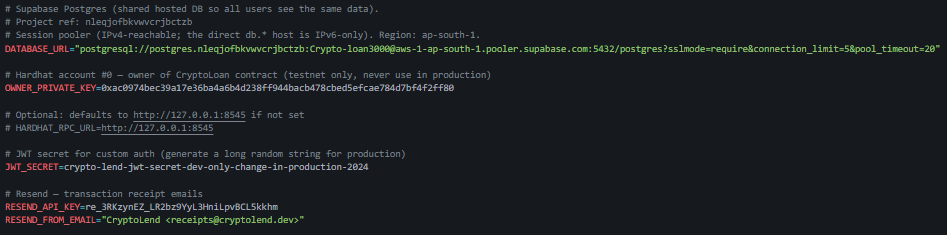
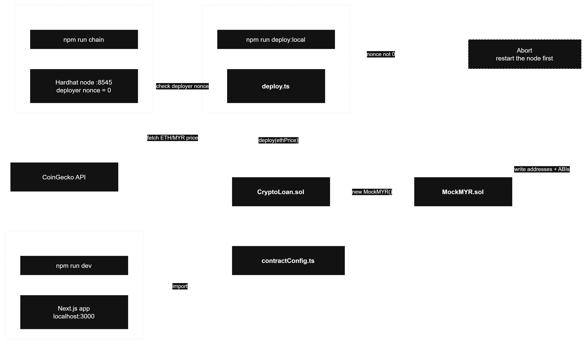

CryptoLend's blockchain layer lives entirely inside `blockchain/`, an independent Hardhat + TypeScript project (Solidity `0.8.24`, optimizer on at 200 runs, `viaIR` enabled) with no runtime dependency on the `web/` Next.js app. The two projects only ever touch through one generated file, `web/src/lib/contractConfig.ts`, produced by the deploy step below.

| Layer              | Technology                                     |
| ------------------ | ---------------------------------------------- |
| Smart contracts    | Solidity `0.8.24`, Hardhat, OpenZeppelin `5.1` |
| Deployment tooling | Hardhat script `deploy.ts`, ethers.js v6       |
| Network            | Local Hardhat node, chain ID `31337`           |

A single `npm run deploy:local` puts **two** contracts on chain, because `CryptoLoan`'s constructor deploys its own token:

| Contract     | How it gets deployed                                                    | Purpose                                    |
| ------------ | ----------------------------------------------------------------------- | ------------------------------------------ |
| `CryptoLoan` | Directly by `deploy.ts`, with the ETH price as its constructor argument | The lending protocol itself (Section 9)    |
| `MockMYR`    | Indirectly, by `CryptoLoan`'s constructor (`new MockMYR()`)             | The 6-decimal MYR token the protocol mints |

### Table of contents, Section 6

- [6.1 Prerequisites & Environment Variables](#61-prerequisites--environment-variables)
- [6.2 Installing Dependencies](#62-installing-dependencies)
- [6.3 Network Configuration](#63-network-configuration)
- [6.4 Running the Deployment](#64-running-the-deployment)
- [6.5 What `deploy.ts` Actually Does](#65-what-deployts-actually-does)
- [6.6 Common Deployment Errors](#66-common-deployment-errors)

---

### 6.1 Prerequisites & Environment Variables

`hardhat.config.ts` reads its secrets from a single `.env` file at the **repo root** (`dotenv.config({ path: "../.env" })`), not from inside `blockchain/`. Copy `.env.example` to `.env` and fill it in.

| Variable            | Required for                                                                                         | Notes                                                                                                              |
| ------------------- | ---------------------------------------------------------------------------------------------------- | ------------------------------------------------------------------------------------------------------------------ |
| `DATABASE_URL`      | The Next.js app (Prisma, Section 8)                                                                  | PostgreSQL connection string                                                                                       |
| `OWNER_PRIVATE_KEY` | Admin-only calls the **server** makes on the user's behalf, such as `setKYC()` and price sync (§9.6) | On local Hardhat this is account #0's well-known test key (`0xac09...2ff80`); never reuse it outside a local chain |
| `HARDHAT_RPC_URL`   | Optional                                                                                             | Defaults to `http://127.0.0.1:8545`                                                                                |

Deploying to the local chain itself needs none of these. Hardhat's built-in `localhost` network signs with its own funded test accounts. `OWNER_PRIVATE_KEY` matters only once the web app starts making admin-signed calls. Despite the variable's name, this is the admin role described in §9.6.



_Figure 6.1: the repo-root `.env`, read by both `hardhat.config.ts` and the Next.js server._

### 6.2 Installing Dependencies

`blockchain/` and `web/` are installed completely independently. There is no workspace or monorepo tooling tying their `node_modules` together, so `npm install` must be run in each folder separately:

```bash
cd blockchain && npm install
cd ../web     && npm install
```

The four packages that matter on the blockchain side:

| Package                            | Role                                                                                                              |
| ---------------------------------- | ----------------------------------------------------------------------------------------------------------------- |
| `hardhat`                          | Local Ethereum node, Solidity compiler, test runner, deploy-script host                                           |
| `@nomicfoundation/hardhat-toolbox` | Bundles ethers.js, Chai matchers and the gas reporter                                                             |
| `@openzeppelin/contracts`          | Audited base contracts the protocol inherits: `ReentrancyGuard`, `Pausable`, `Ownable2Step`, `ERC20`, `SafeERC20` |
| `dotenv`                           | Loads the repo-root `.env` into `hardhat.config.ts`                                                               |

Node is pinned to **20** via the repo's `.nvmrc` (`nvm use` if available). Compiling happens automatically as part of the deploy, so there is no separate build step to remember.

### 6.3 Network Configuration

The project runs against a **local Hardhat node**, declared in `hardhat.config.ts`:

```ts
networks: {
  hardhat:   { chainId: 31337 },
  localhost: { url: "http://127.0.0.1:8545", chainId: 31337 },
}
```

`hardhat` is the in-process network used by `npm test`; `localhost` is the standalone node the app connects to. Both use chain ID **`31337`**, which is also the chain ID MetaMask must be configured with (RPC `http://127.0.0.1:8545`) before it can talk to the deployed contracts. Section 7.1 onward covers the wallet side.

### 6.4 Running the Deployment

The whole system runs on **three commands**, one per terminal:

```bash
# Terminal A (keep running)     # Terminal B (one-shot)        # Terminal C (keep running)
cd blockchain                   cd blockchain                  cd web
npm run chain                   npm run deploy:local           npm run dev
```

| #   | Command                | Runs                                                | What it does                                                                                                     |
| --- | ---------------------- | --------------------------------------------------- | ---------------------------------------------------------------------------------------------------------------- |
| 1   | `npm run chain`        | `hardhat node`                                      | Starts an in-memory Ethereum node on `127.0.0.1:8545` and prints 20 funded test accounts with their private keys |
| 2   | `npm run deploy:local` | `hardhat run scripts/deploy.ts --network localhost` | Compiles, deploys `CryptoLoan` (which deploys `MockMYR`), and writes `contractConfig.ts` (§6.5)                  |
| 3   | `npm run dev`          | `next dev`                                          | Starts the Next.js app on `http://localhost:3000`, reading the addresses and ABIs step 2 just wrote              |

**Order matters.** Terminal A must be running before Terminal B, and Terminal B must finish before the app in Terminal C can reach any contract.

**Terminal A**, the local chain. The private keys printed here are what get imported into MetaMask, and each account starts with 10,000 test ETH:

```
Started HTTP and WebSocket JSON-RPC server at http://127.0.0.1:8545/

Accounts
========
Account #0: 0xf39Fd6e51aad88F6F4ce6aB8827279cffFb92266 (10000 ETH)
Private Key: 0xac0974bec39a17e36ba4a6b4d238ff944bacb478cbed5efcae784d7bf4f2ff80

Account #1: 0x70997970C51812dc3A010C7d01b50e0d17dc79C8 (10000 ETH)
Private Key: 0x59c6995e998f97a5a0044966f0945389dc9e86dae88c7a8412f4603b6b78690d
...
```

**Terminal B**, the deploy. The script prints exactly what it did and what to do next:

```
Deploying with account: 0xf39Fd6e51aad88F6F4ce6aB8827279cffFb92266
Balance: 10000.0 ETH

Fetching live ETH/MYR price from CoinGecko…
Initial ETH price: RM 18,432

CryptoLoan deployed to: 0x5FbDB2315678afecb367f032d93F642f64180aa3
MockMYR    deployed to: 0xe7f1725E7734CE288F8367e1Bb143E90bb3F0512
ETH price set to:       RM 18,432

Contract config written to: .../web/src/lib/contractConfig.ts

Next steps:
  1. Add Hardhat network to MetaMask (RPC: http://127.0.0.1:8545, Chain ID: 31337)
  2. Import an account using a private key from 'npm run chain' output
  3. Open http://localhost:3000 and click 'Connect Wallet'
```

Both addresses are deterministic on a fresh node, and the guard in [6.5](#65-what-deployts-actually-does) keeps them that way.


_Figure 6.4: the deployment flow. The three terminals run at the same time, but the arrows crossing between them are why the start order matters. Drawn in draw.io, source file `asset/Deployment-Flow.drawio`._

Restarting the Hardhat node wipes all chain state, so **the contracts must be redeployed** (`npm run deploy:local`) after every restart. This is called out again in Section 11, Troubleshooting.

### 6.5 What `deploy.ts` Actually Does

`scripts/deploy.ts` is not a bare `factory.deploy()` call. It adds three behaviours on top.

**1. Fresh-node guard.** `CryptoLoan`'s address is derived from `(deployer, nonce)`, and its constructor deploys `MockMYR` internally, so _that_ address is derived from `(CryptoLoan's address, its own nonce 0)`. Deploying onto a node whose deployer nonce isn't `0` would silently place both contracts at new addresses, and since MetaMask keys imported ERC-20 tokens by address, every redeploy would leave a stale duplicate "MYR" token behind in the wallet. The script therefore refuses to run unless the deployer's nonce is `0`, with an explicit override:

```ts
const nonce = await ethers.provider.getTransactionCount(deployer.address);
if (nonce !== 0 && process.env.FORCE_DEPLOY !== "1") {
  console.error(/* ...restart the node, or set FORCE_DEPLOY=1... */);
  process.exitCode = 1;
  return;
}
```

What that refusal looks like in practice:

```
✗ Node is not fresh — deployer nonce is 7, expected 0.
  Redeploying now would place MockMYR at a NEW address and add another
  duplicate "MYR" token in MetaMask.

  Fix: restart the Hardhat node, then deploy as the first action:
    1) Stop the running node, then:  npm run chain
    2) In a second terminal:         npm run deploy:local

  This keeps the MYR address constant. To deploy anyway (and accept a new
  token address), re-run with FORCE_DEPLOY=1.
```

This is a refusal to proceed, not a crash: the exit code is `1` and nothing was deployed.

**2. Live price seeding.** Before deploying, it fetches the current ETH/MYR rate from CoinGecko so the contract doesn't start on a stale hardcoded number, falling back to `RM 18,000` if the API call fails or times out (5s):

```ts
const res = await fetch(
  "https://api.coingecko.com/api/v3/simple/price?ids=ethereum&vs_currencies=myr",
  { signal: AbortSignal.timeout(5000) },
);
```

The fallback is visible in the output when it fires, so a demo never silently runs on a made-up price:

```
Could not fetch live price: The operation was aborted due to timeout
Falling back to hardcoded price: RM 18,000
```

**3. Deploy, then generate the frontend config.** `CryptoLoan` is deployed with that price as its constructor argument (its constructor deploys `MockMYR` as part of the same transaction). The script then reads the compiled ABIs out of `artifacts/` and writes a single auto-generated file the Next.js app imports directly, with no manual address copy-pasting between the two projects:

```ts
const CryptoLoan = await ethers.getContractFactory("CryptoLoan");
const loan = await CryptoLoan.deploy(ethPrice);
await loan.waitForDeployment();

const loanAddress = await loan.getAddress();
const myrAddress = await loan.myr();
// ...writes web/src/lib/contractConfig.ts with CONTRACT_ADDRESSES, CRYPTO_LOAN_ABI, MOCK_MYR_ABI
```

The generated file opens with a warning header, then the addresses and both full ABIs:

```ts
// !! Auto-generated by blockchain/scripts/deploy.ts — do not edit manually !!
// Re-run: npm run deploy:local

export const HARDHAT_CHAIN_ID = 31337;
export const HARDHAT_RPC_URL = "http://127.0.0.1:8545";
export const ETH_PRICE_MYR = 18432;

export const CONTRACT_ADDRESSES = {
  CryptoLoan: "0x5FbDB2315678afecb367f032d93F642f64180aa3",
  MockMYR: "0xe7f1725E7734CE288F8367e1Bb143E90bb3F0512",
} as const;

export const CRYPTO_LOAN_ABI = [
  /* ... */
] as const;
export const MOCK_MYR_ABI = [
  /* ... */
] as const;
```

This is the only file linking the two npm projects, it is regenerated on every deploy, and it is the exact file `WalletContext.tsx` imports to build its contract instances (see [9.1](#91-contract-architecture)).

### 6.6 Common Deployment Errors

Every message below comes from the deploy script or from a `require()` in the contract. Each has one cause and one fix.

| Error                                                 | Where it appears                                                      | Fix                                                                                                                                                                           |
| ----------------------------------------------------- | --------------------------------------------------------------------- | ----------------------------------------------------------------------------------------------------------------------------------------------------------------------------- |
| `Node is not fresh — deployer nonce is X, expected 0` | `npm run deploy:local`, before any contract is touched (§6.5)         | Restart the Hardhat node (`npm run chain`) and deploy as the very first action against it, or re-run with `FORCE_DEPLOY=1` to accept a new `MockMYR` address                  |
| `Could not fetch live price` / `Falling back to…`     | `npm run deploy:local`, during price seeding (§6.5)                   | Not an error, only a warning. The contract deploys at `RM 18,000` and the price can be corrected on-chain afterwards                                                          |
| `Invalid price`                                       | `CryptoLoan` constructor / `setEthPrice()` (contract-level `require`) | The price argument was `0`; pass a positive integer                                                                                                                           |
| `Price move too large`                                | `setEthPrice()` (contract-level `require`, `MAX_PRICE_CHANGE`)        | A single call moved the price by more than 20%; step toward the target in smaller increments, the way `price-sync.ts` does automatically ([9.6](#96-admin--oracle-functions)) |
| `Rate exceeds cap`                                    | `setBaseRate()` (contract-level `require`, `MAX_BASE_RATE_BPS`)       | Requested `rateBps` exceeds 1500 (15%)                                                                                                                                        |
| `Cap below outstanding debt`                          | `setSupplyCap()` (contract-level `require`)                           | The new `supplyCap` is under `totalBorrowed`; that would pin utilisation at 100% and every new borrow at the rate ceiling, with no way to lend out of it (§9.6)               |
| `could not detect network` / `ECONNREFUSED`           | `npm run deploy:local`, or the app in Terminal C                      | The Hardhat node isn't running. Start Terminal A (`npm run chain`) first                                                                                                      |

---
