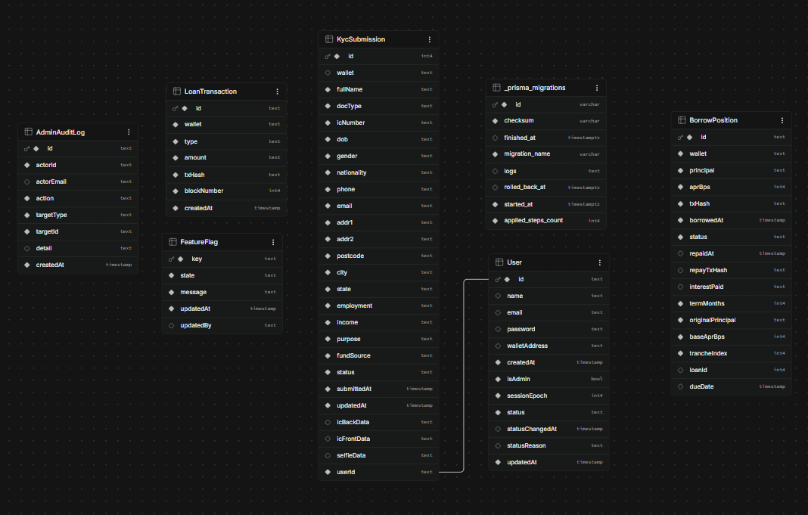

## 8. Database Design

The web app persists to a single **PostgreSQL** database (Railway in production) via **Prisma** ORM (`web/prisma/schema.prisma`). `BankAccount`/`BankTransfer` never appear in the schema. Bank Transfer was dropped from the product before this schema was written, so there's nothing to remove here.

### Table of contents, Section 8

- [8.1 On-Chain vs Off-Chain Split](#81-on-chain-vs-off-chain-split)
- [8.2 Schema at a Glance](#82-schema-at-a-glance)
- [8.3 Entity-Relationship Diagram](#83-entity-relationship-diagram)
- [8.4 Table-by-Table Walkthrough](#84-table-by-table-walkthrough)

---

### 8.1 On-Chain vs Off-Chain Split

The database is **not** the source of truth for money. That role belongs entirely to the `CryptoLoan` contract (collateral, debt, interest, the per-wallet `kycApproved` flag; see Section 9 below). Postgres owns everything else (accounts, KYC submissions and documents, feature flags, and the admin audit trail), and one table, `LoanTransaction`, exists purely as a **read-optimised mirror** of on-chain events, not as a payment record. If the database and the chain ever disagree about a balance, the chain wins; Section 7.5 Portfolio (in the full document) makes this explicit by falling back to the database mirror only when a live chain read isn't available.

### 8.2 Schema at a Glance

The deployed Supabase database holds **seven tables**, but only **six are application models**. The seventh, `_prisma_migrations`, is Prisma's own bookkeeping table: it records which migrations have been applied, and no application code ever reads or writes it.

| #   | Table                | Columns | Kind        | Purpose                                                                                                                                                       |
| --- | -------------------- | :-----: | ----------- | ------------------------------------------------------------------------------------------------------------------------------------------------------------- |
| 1   | `User`               |   12    | Model       | The account: `email`+`password` and/or a linked `walletAddress`, `isAdmin`, `status` (`ACTIVE`/`RESTRICTED`/`SUSPENDED`), `sessionEpoch` for JWT invalidation |
| 2   | `KycSubmission`      |   26    | Model       | One per user (not per wallet): personal, address and financial fields, plus the three ID document images                                                      |
| 3   | `LoanTransaction`    |    7    | Model       | A mirrored copy of on-chain protocol events, keyed by wallet with a unique `txHash`                                                                           |
| 4   | `BorrowPosition`     |   16    | Model       | One row per on-chain loan, carrying the installment-plan metadata the contract doesn't store                                                                  |
| 5   | `FeatureFlag`        |    5    | Model       | Admin overrides (`ON`/`MAINTENANCE`/`HIDDEN`) on top of the `lib/features.ts` registry                                                                        |
| 6   | `AdminAuditLog`      |    8    | Model       | Append-only record of every admin mutation                                                                                                                    |
| 7   | `_prisma_migrations` |    8    | Prisma only | Migration history (`migration_name`, `checksum`, `applied_steps_count`, `rolled_back_at`…). Created and maintained by Prisma, never by the app                |

The six models are defined in `web/prisma/schema.prisma` and applied through 11 migrations under `web/prisma/migrations/`, from `20260522064644_init` through `20260807000000_add_loan_maturity`.

Only `KycSubmission` and `BorrowPosition` are wide tables, and for different reasons: `KycSubmission` holds a whole verification form plus three base64 images, while `BorrowPosition` has accumulated fields as the loan model grew (§8.4).

### 8.3 Entity-Relationship Diagram



_Figure 8.3: the deployed schema. Source file `asset/Database-ERD.drawio`._

The diagram shows the schema **as actually deployed**, with Postgres types (`text`, `int4`, `timestamp`, `varchar`, `timestamptz`, `bool`) rather than Prisma's, so it can be checked directly against Supabase's Table Editor. Foreign keys are listed directly under each primary key for readability; per-column nullability is given in the tables in [8.4](#84-table-by-table-walkthrough).

**One relationship line, and only one.** `User → KycSubmission` is the sole enforced foreign key. `LoanTransaction`, `BorrowPosition` and `AdminAuditLog` key off a **wallet address or actor-ID string** instead of a relation, because they record on-chain and admin activity that must survive the referenced account being suspended or its wallet unlinked. Supabase's own visualizer draws the same single connector, from `KycSubmission.userId` to `User.id`.

**`_prisma_migrations` is in the diagram but not in the application.** It is Prisma's migration history, created and maintained entirely by the CLI; no application code reads or writes it. It appears here because it is one of the seven tables in the deployed `public` schema, and leaving it out would make the diagram disagree with Supabase. Mermaid does not accept a leading underscore in an entity name, so it is drawn as `prisma_migrations`.

**`BorrowPosition.trancheIndex` is in the database but not in the Prisma model.** It therefore appears here but not in the model listing in §8.4, which explains the consequence.

The 18 nullable columns, everything else being `NOT NULL`:

| Table             | Nullable columns                                                                |
| ----------------- | ------------------------------------------------------------------------------- |
| `User`            | `name`, `email`, `password`, `walletAddress`, `statusChangedAt`, `statusReason` |
| `KycSubmission`   | `wallet`, `icBackData`, `icFrontData`, `selfieData`                             |
| `BorrowPosition`  | `repaidAt`, `repayTxHash`, `interestPaid`, `loanId`, `dueDate`                  |
| `FeatureFlag`     | `updatedBy`                                                                     |
| `AdminAuditLog`   | `actorEmail`, `detail`                                                          |
| `LoanTransaction` | none, every column is required                                                  |

Uniqueness is not drawn either: `User.email` and `User.walletAddress` are unique, as are `LoanTransaction.txHash`, `BorrowPosition.txHash` and `KycSubmission.userId`.

### 8.4 Table-by-Table Walkthrough

**`User`**, the account record:

```prisma
model User {
  id            String        @id @default(cuid())
  name          String?
  email         String?       @unique
  password      String?
  walletAddress String?       @unique
  isAdmin       Boolean       @default(false)
  status        String        @default("ACTIVE")
  statusReason  String?
  statusChangedAt DateTime?
  sessionEpoch  Int           @default(0)
  createdAt     DateTime      @default(now())
  updatedAt     DateTime      @default(now()) @updatedAt
  kyc           KycSubmission?
}
```

Either `email`+`password`, `walletAddress`, or both, may be set (never `walletAddress`-only _and_ email-only-without-a-password; see the Settings invariant in Section 7.14). `sessionEpoch` is bumped to invalidate every JWT already issued to that user, since sessions are stateless cookies rather than server-tracked.

`status` has three values, and the difference between the last two matters:

| `status`     | Effect                                                                                                                                           |
| ------------ | ------------------------------------------------------------------------------------------------------------------------------------------------ |
| `ACTIVE`     | Normal account                                                                                                                                   |
| `RESTRICTED` | May still sign in and read, but every write is refused                                                                                           |
| `SUSPENDED`  | Refused at sign-in entirely: `getSessionUser()` treats the session as absent, and suspending bumps `sessionEpoch` to kill any token already live |

All three are **off-chain only**. As the schema's own comment states, a user in any of these states can still call the contract directly from their own wallet; `lib/authz.ts` carries the full caveat. Restricting an account stops CryptoLend's app from acting for them, not the blockchain from accepting their signature.

As deployed, 12 columns:

| Column            | Type        | Null | Notes                                                 |
| ----------------- | ----------- | :--: | ----------------------------------------------------- |
| `id`              | `text` PK   |  No  | `cuid()`                                              |
| `name`            | `text`      | Yes  | Display name, auto-generated for wallet-only sign-ups |
| `email`           | `text`      | Yes  | Unique when set                                       |
| `password`        | `text`      | Yes  | bcrypt hash; null for wallet-only accounts            |
| `walletAddress`   | `text`      | Yes  | Unique when set                                       |
| `isAdmin`         | `bool`      |  No  | Default `false`                                       |
| `status`          | `text`      |  No  | Default `ACTIVE`                                      |
| `statusReason`    | `text`      | Yes  | Free-text reason for a status change                  |
| `statusChangedAt` | `timestamp` | Yes  | When the status last changed                          |
| `sessionEpoch`    | `int4`      |  No  | Default `0`; bumped to invalidate JWTs                |
| `createdAt`       | `timestamp` |  No  | Default `now()`                                       |
| `updatedAt`       | `timestamp` |  No  | Auto-updated                                          |

The four nullable identity columns (`name`, `email`, `password`, `walletAddress`) are what allow the two independent sign-up paths to share one table.

**`KycSubmission`**, one row per **user**, not per wallet:

```prisma
model KycSubmission {
  id          Int      @id @default(autoincrement())
  userId      String   @unique
  user        User     @relation(fields: [userId], references: [id])
  wallet      String?
  fullName    String
  docType     String   @default("ic")
  icNumber    String
  dob         String
  gender      String
  nationality String
  phone       String
  email       String
  addr1       String
  addr2       String   @default("")
  postcode    String
  city        String
  state       String
  employment  String
  income      String
  purpose     String
  fundSource  String
  icFrontData String?
  icBackData  String?
  selfieData  String?
  status      String   @default("pending")
  submittedAt DateTime @default(now())
  updatedAt   DateTime @updatedAt

  @@index([wallet])
}
```

Because `userId` is `@unique`, verification survives a wallet being unlinked and relinked, and a freed wallet cannot inherit a stranger's approval (see Section 7.13). `wallet` is only the on-chain anchor used when the server calls `setKYC()` ([9.6](#96-admin--oracle-functions)), and is `null` until a wallet is linked. The five wizard steps map directly onto its fields: personal info (`fullName`…`nationality`), contact (`phone`, `email`), address (`addr1`…`state`), financial declaration (`employment`, `income`, `purpose`, `fundSource`), and documents (`icFrontData`, `icBackData`, `selfieData`, stored as base64 data URIs _in the row itself_, served back out through `GET /api/kyc/documents` rather than an external object store).

At 26 columns this is by far the widest table in the schema, which is expected: it is a whole verification form plus three embedded images, stored as one row per account. Grouped by wizard step:

| Group              | Columns                                                              | Null |
| ------------------ | -------------------------------------------------------------------- | :--: |
| Keys               | `id` (`int4` PK, auto-increment), `userId` (`text`, unique)          |  No  |
| On-chain anchor    | `wallet` (`text`)                                                    | Yes  |
| 1. Personal info   | `fullName`, `docType`, `icNumber`, `dob`, `gender`, `nationality`    |  No  |
| 1. Contact         | `phone`, `email`                                                     |  No  |
| 2. Address         | `addr1`, `addr2`, `postcode`, `city`, `state`                        |  No  |
| 3. Financial       | `employment`, `income`, `purpose`, `fundSource`                      |  No  |
| 4. Documents       | `icFrontData`, `icBackData`, `selfieData` (`text`, base64 data URIs) | Yes  |
| Review / lifecycle | `status` (`text`), `submittedAt`, `updatedAt` (`timestamp`)          |  No  |

Every field is `text` apart from the `int4` primary key and the two timestamps, because the form is stored as submitted instead of being coerced into typed columns. `dob` holding a `text` value where a `date` would fit is the clearest example of that trade-off.

**`LoanTransaction`**, a denormalised mirror of on-chain protocol events:

```prisma
model LoanTransaction {
  id          String   @id @default(cuid())
  wallet      String
  type        String
  amount      String
  txHash      String   @unique
  blockNumber Int
  createdAt   DateTime @default(now())

  @@index([wallet])
}
```

Indexed by `wallet` and unique on `txHash`, so re-indexing the same block twice cannot double-insert. It backs the Explorer (Section 7.6) and Portfolio history (Section 7.5) without hitting an RPC node on every page load. It's populated by `POST /api/loan-tx`, which `WalletContext.tsx` calls right after every confirmed transaction (see the `saveTxToDB` calls throughout [9.5](#95-core-function-walkthroughs)).

As deployed, 7 columns, every one of them non-null:

| Column        | Type        | Notes                                                          |
| ------------- | ----------- | -------------------------------------------------------------- |
| `id`          | `text` PK   | `cuid()`                                                       |
| `wallet`      | `text`      | Indexed                                                        |
| `type`        | `text`      | Event name, e.g. `Borrowed`, `Repaid`, `SupplyInterestClaimed` |
| `amount`      | `text`      | Stored as a string to stay bigint-safe                         |
| `txHash`      | `text`      | **Unique**, so re-indexing is idempotent                       |
| `blockNumber` | `int4`      | Source block                                                   |
| `createdAt`   | `timestamp` | Default `now()`                                                |

`amount` is `text` rather than a numeric type for the same reason it is a string in the frontend: MYR values are `1e6`-scaled integers that would lose precision through a JavaScript `number`.

**`BorrowPosition`**, one row per on-chain loan, carrying the plan metadata the contract doesn't store:

```prisma
model BorrowPosition {
  id           String    @id @default(cuid())
  wallet       String
  /// On-chain loan index for this wallet (CryptoLoan._userLoans[wallet][loanId]).
  loanId       Int?
  /// This loan's on-chain due date (startTime + term), denormalized at borrow time.
  dueDate      DateTime?
  principal    String
  originalPrincipal String @default("0")
  aprBps       Int
  /// Base rate at the same moment; display only, for the "base + premium" split.
  baseAprBps   Int       @default(0)
  termMonths   Int       @default(1)
  txHash       String    @unique
  borrowedAt   DateTime  @default(now())
  status       String    @default("OPEN") // OPEN | REPAID | LIQUIDATED
  repaidAt     DateTime?
  repayTxHash  String?
  interestPaid String?

  @@index([wallet, status])
  @@index([wallet, loanId])
}
```

This table's role changed when the contract moved to per-loan state. The chain now keeps a real `Loan[]` array per wallet (§9.3), so principal, APR, due date and interest are all authoritative on-chain. This row no longer _reconstructs_ itemisation the contract lacks, it **annotates** an existing on-chain loan.

`loanId` is the join key: it's read out of the `LoanCreated` event right after the borrow confirms, and it's what lets a repayment settle exactly the rows its per-loan `Repaid(loanId, …)` events covered (§9.5.3). It is nullable only for rows written before the per-loan contract existed.

Fields that exist only here:

| Field               | Why the chain doesn't have it                                                                                                                                                                                                                                                                     |
| ------------------- | ------------------------------------------------------------------------------------------------------------------------------------------------------------------------------------------------------------------------------------------------------------------------------------------------- |
| `termMonths`        | The 1/3/6/12 installment plan. The contract stores `termDays` (30/90/180/365) and a `dueDate`, but has no concept of monthly instalments; that is a UI construct                                                                                                                                  |
| `originalPrincipal` | Frozen at creation while `principal` shrinks as payments settle. The difference between the two lets an early payoff advance "Month M of N" correctly, instead of dividing by elapsed calendar time and showing a plan as behind when it is actually paid ahead                                   |
| `baseAprBps`        | The base rate at borrow time, so the Repay tab can show "3.00% base + 0.36% utilisation" instead of only the blended figure. Display only; `aprBps` is what interest is priced off everywhere. It defaults to `0`, meaning "unknown", and the UI falls back to an APR-only display for those rows |
| `dueDate`           | Denormalised for admin/reporting queries. The dashboard reads the live value from the chain, never from here                                                                                                                                                                                      |

As deployed, 16 columns. The nullable ones are exactly the fields that only become known later (at settlement) or that were added after the first rows already existed:

| Column              | Type        | Null | Notes                                              |
| ------------------- | ----------- | :--: | -------------------------------------------------- |
| `id`                | `text` PK   |  No  | `cuid()`                                           |
| `wallet`            | `text`      |  No  | Indexed                                            |
| `principal`         | `text`      |  No  | Shrinks as payments settle                         |
| `originalPrincipal` | `text`      |  No  | Frozen at creation                                 |
| `aprBps`            | `int4`      |  No  | Locked effective rate                              |
| `baseAprBps`        | `int4`      |  No  | Default `0` = "unknown"                            |
| `termMonths`        | `int4`      |  No  | Default `1`                                        |
| `txHash`            | `text`      |  No  | **Unique**                                         |
| `borrowedAt`        | `timestamp` |  No  | Default `now()`                                    |
| `status`            | `text`      |  No  | `OPEN` / `REPAID` / `LIQUIDATED`                   |
| `loanId`            | `int4`      | Yes  | On-chain join key; null only for pre-per-loan rows |
| `dueDate`           | `timestamp` | Yes  | Denormalised from chain                            |
| `repaidAt`          | `timestamp` | Yes  | Set at settlement                                  |
| `repayTxHash`       | `text`      | Yes  | Set at settlement                                  |
| `interestPaid`      | `text`      | Yes  | Set at settlement                                  |
| `trancheIndex`      | `int4`      |  No  | **Not in the Prisma model**, see below             |

**That last column is schema drift.** The live table carries 16 columns, one more than the 15 the Prisma model above declares: an extra `trancheIndex` (`int4`, **NOT NULL**). It appears in neither `schema.prisma` nor any of the 11 migrations, which means it was introduced by a `prisma db push` (which writes schema changes straight to the database without recording a migration) and later removed from the model without a corresponding migration to drop the column.

The column being `NOT NULL` rather than nullable makes this more than cosmetic. Prisma generates its `INSERT` statements from the model, so it never supplies a value for a column it doesn't know about. A `NOT NULL` column with no default would therefore reject every insert into this table; since borrowing demonstrably works, the column must carry a database-level default (almost certainly `0`) left behind from when it was created. The application is relying on that default without anything in the codebase saying so.

Nothing reads or writes the column, so no behaviour depends on its value, but it is a mismatch between the schema file and the database, not a documented field. Dropping the column, or regenerating a migration against the live database, would reconcile the two and remove the hidden dependency on that default.

**`FeatureFlag`**, one optional override row per feature key declared in `lib/features.ts`:

```prisma
model FeatureFlag {
  key       String   @id
  state     String   @default("ON")
  message   String   @default("")
  updatedAt DateTime @default(now()) @updatedAt
  updatedBy String?
}
```

An **empty table means every feature defaults to on**. `state` is `"ON"`, `"MAINTENANCE"` (visible, blocked, shows `message`), or `"HIDDEN"` (removed from navigation, direct routes 404). This is the mechanism behind every "temporarily paused" state referenced throughout Section 7: signups (7.1), logins (7.2), and each of the five loan actions (7.7-7.11) independently.

As deployed, 5 columns, and the smallest table in the schema:

| Column      | Type        | Null | Notes                                      |
| ----------- | ----------- | :--: | ------------------------------------------ |
| `key`       | `text` PK   |  No  | The feature key from `lib/features.ts`     |
| `state`     | `text`      |  No  | Default `ON`                               |
| `message`   | `text`      |  No  | Default `""`, shown in `MAINTENANCE` state |
| `updatedAt` | `timestamp` |  No  | Auto-updated                               |
| `updatedBy` | `text`      | Yes  | Which admin last changed it                |

There is no `enabled` boolean. Because `state` is a three-value string, `MAINTENANCE` (visible but blocked, with an explanation) can exist as a state distinct from `HIDDEN` (gone entirely).

**`AdminAuditLog`**, append-only by design:

```prisma
model AdminAuditLog {
  id         String   @id @default(cuid())
  actorId    String
  actorEmail String?
  action     String
  targetType String
  targetId   String
  detail     String?
  createdAt  DateTime @default(now())

  @@index([createdAt])
  @@index([targetType, targetId])
}
```

Never edited or deleted by the app. There is no update or delete endpoint for it (see Section 7.12). `detail` stores a JSON blob (`{ before, after }`) as text instead of a native JSON column, to stay portable across the raw-SQL paths the app uses elsewhere. Indexed on `createdAt` (for the audit feed) and on `(targetType, targetId)` (for "show me every action taken on this user/submission").

As deployed, 8 columns:

| Column       | Type        | Null | Notes                                                                    |
| ------------ | ----------- | :--: | ------------------------------------------------------------------------ |
| `id`         | `text` PK   |  No  | `cuid()`                                                                 |
| `actorId`    | `text`      |  No  | The admin's user id, stored as a plain string, not an FK                 |
| `actorEmail` | `text`      | Yes  | Denormalised so the entry stays readable if the account is later deleted |
| `action`     | `text`      |  No  | e.g. `PRICE_SYNC`, `KYC_APPROVE`                                         |
| `targetType` | `text`      |  No  | Indexed with `targetId`                                                  |
| `targetId`   | `text`      |  No  | Indexed with `targetType`                                                |
| `detail`     | `text`      | Yes  | JSON blob `{ before, after }` stored as text                             |
| `createdAt`  | `timestamp` |  No  | Indexed, for the audit feed                                              |

`actorEmail` is denormalised on purpose. An audit trail that becomes unreadable once an admin account is removed would defeat its own purpose.

---
